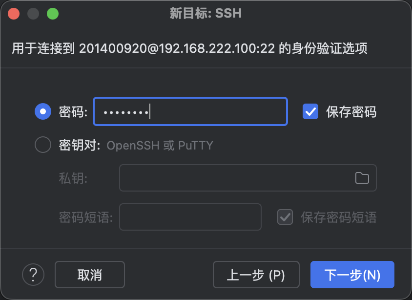
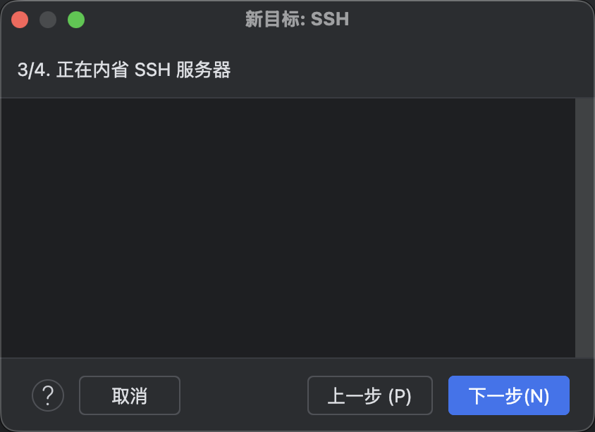
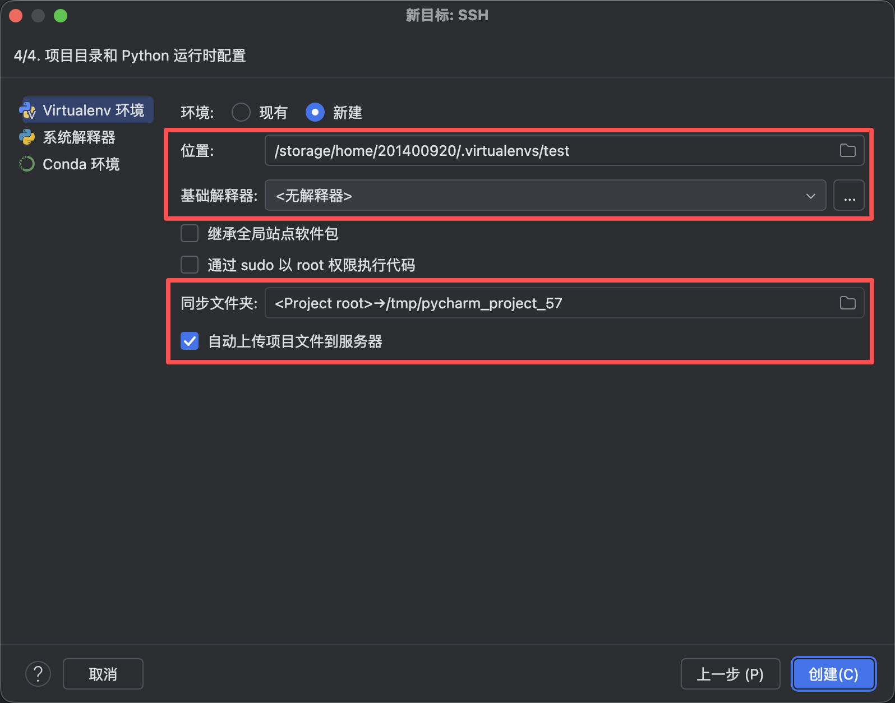
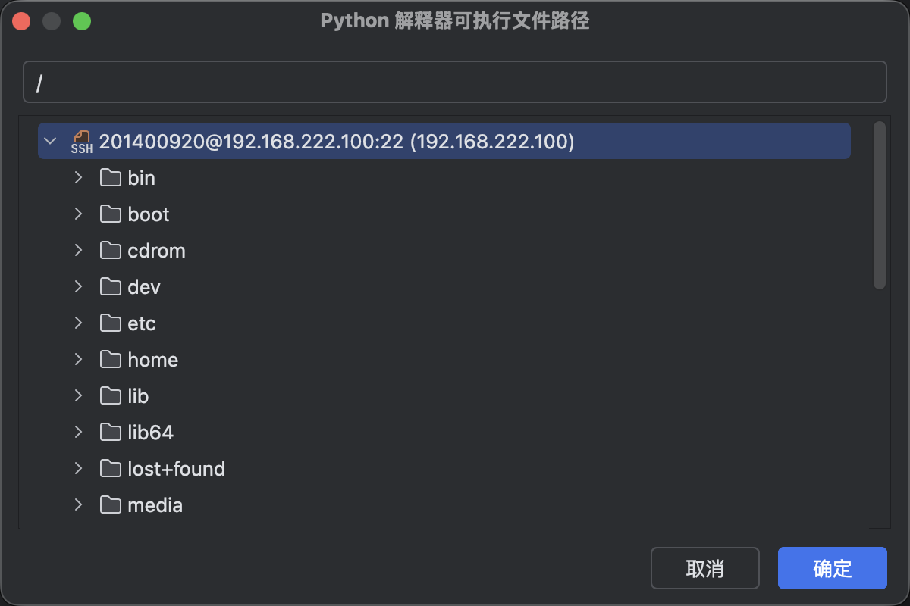
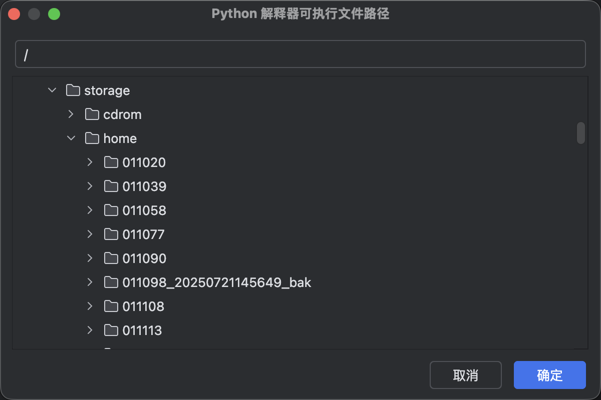
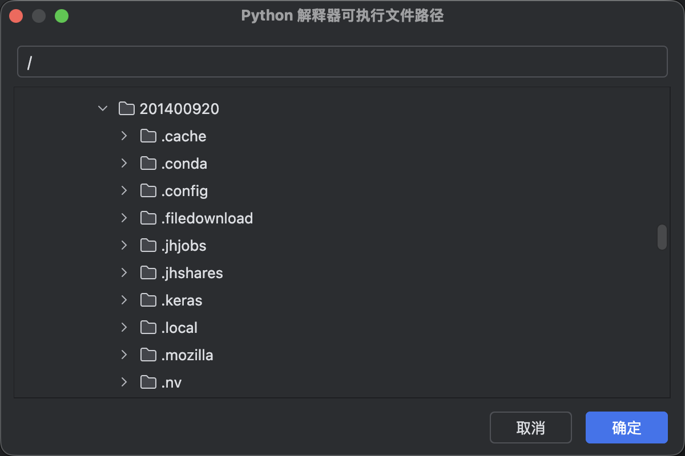
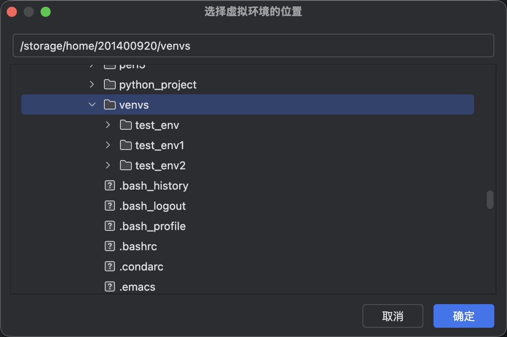
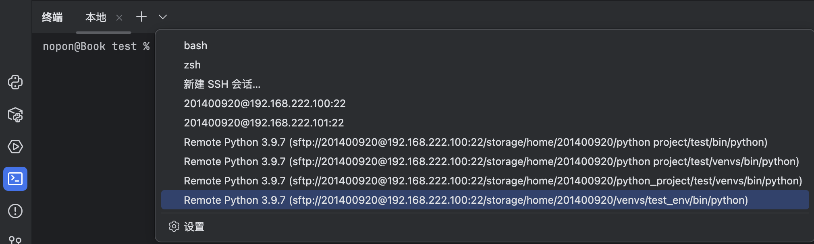
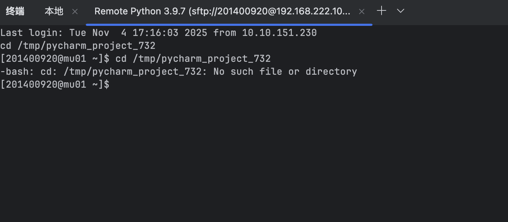

# PyCharm SSH连接教程

第一步，进入pycharm项目页面后，点击右上角的设置按钮

    

左边选择python，进入解释器，点击右方的添加解释器，选择“基于SSH”

    

第一次进入，选择新建，主机处填写192.168.222.100，用户名处填写你的账户名，点击下一步

    

输入密码，点击下一步

自省页面，等待即可，自省结束“下一步”按钮会亮起，点击下一步

远程项目设置页面，我们主要关注红框内的选项

首先开始设置虚拟环境位置，点击右侧文件夹图标，进入如下页面

进入Storage/Home/【你的账户名】，比如我的账户名是201400920，我就进入201400920文件夹，如下图所示

右键点击账户对应的文件夹，新建环境存放目录，我命名为venvs（即virtual environments），
再右击venvs文件夹，新建一个目录，该目录命名为你想要的环境名，例如我现在想要的是一个用于测试的环境，
我新建一个名为test_env的新目录，然后选择该目录，点击确定后完成。

之后我们选择基础解释器路径，点击省略号图标后进入远程主机根目录，依次进入并选择Storage/Software/anaconda3/bin/python3.9

最后，勾选“自动上传项目文件到服务器”，设置同步文件夹路径，之后项目中的内容会被同步到该路径下，依次进入Storage/Home/[你的账户名],
这里建议在自己的用户根目录下新建一个存放项目的文件夹，命名为python_project，再在此文件夹下新建要存放对应项目的项目文件夹。
最终的路径应为Storage/Home/【你的账户名】/python_project/【你的项目名称】

全部设置完之后点击右下角的“创建”按钮，等待其配置完成后，点击pycharm页面左下角的“终端”按钮，点击下拉箭头，选择刚刚设置好的远程终端，

选择后进入如下终端页面，则SSH连接完成。

