# PyCharm SSH连接教程

第一步，进入pycharm项目页面后，依次点击上方的工具-部署-配置选项

    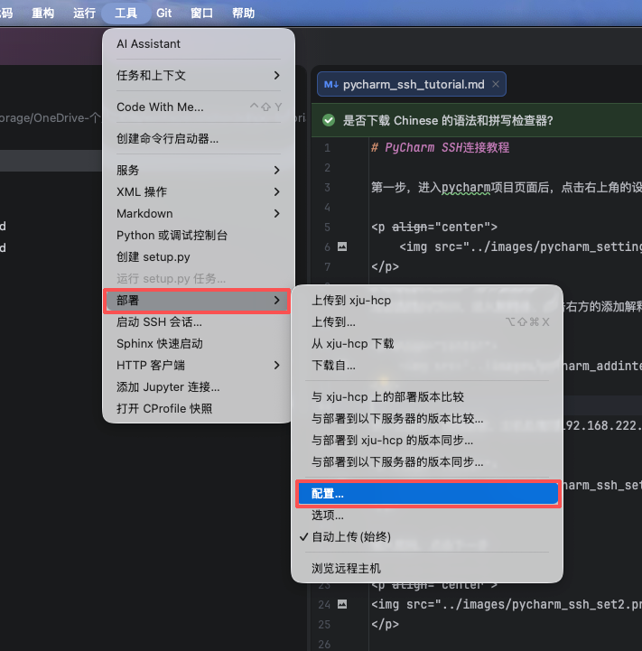

进入如下的配置页面，点击左上方+号添加服务器，选择SFTP,设置名称

    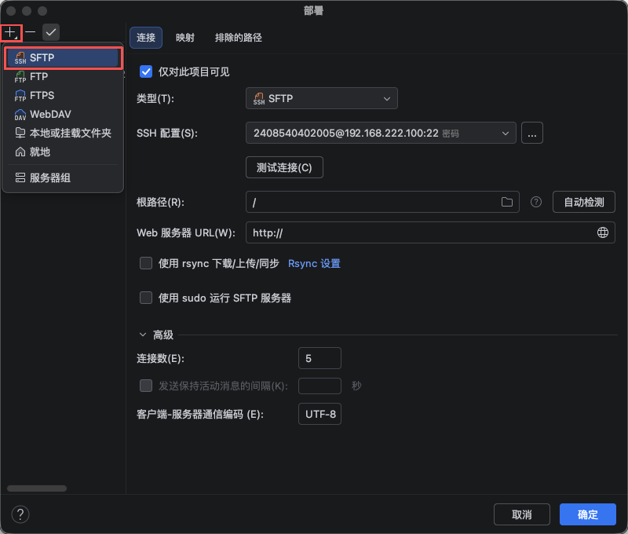

    

点击红框进入SSH配置页面

    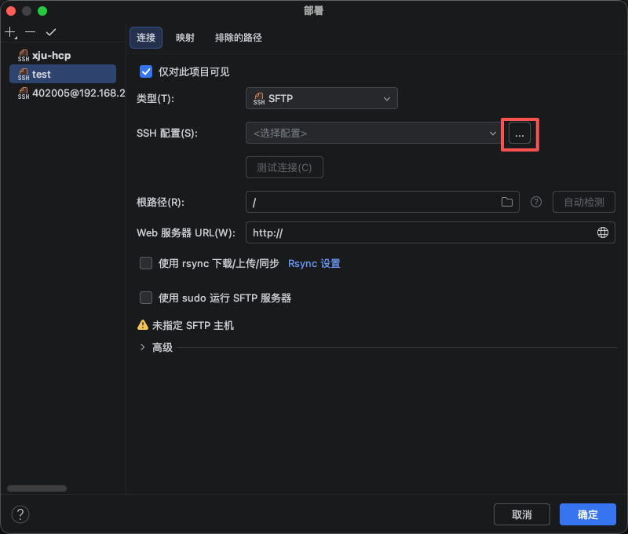

点击左上角+号添加配置，关注红框选中的区域，依次填入主机ip地址，自己的用户名（即学号）和密码，
记得钩上保存密码

    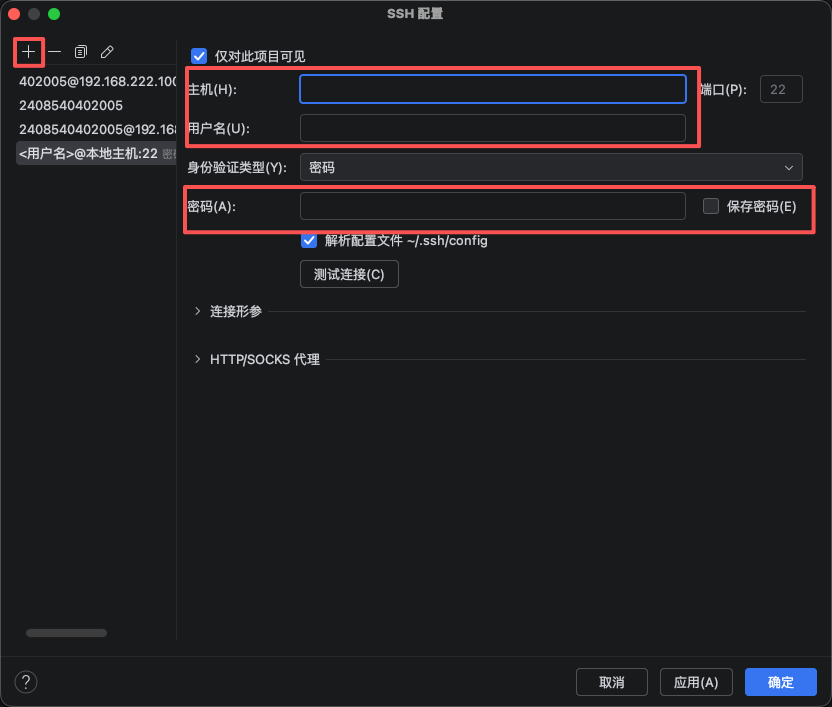

全部输入完之后点击测试连接，如果成功连接即可点击确定退出，返回到服务器设置界面

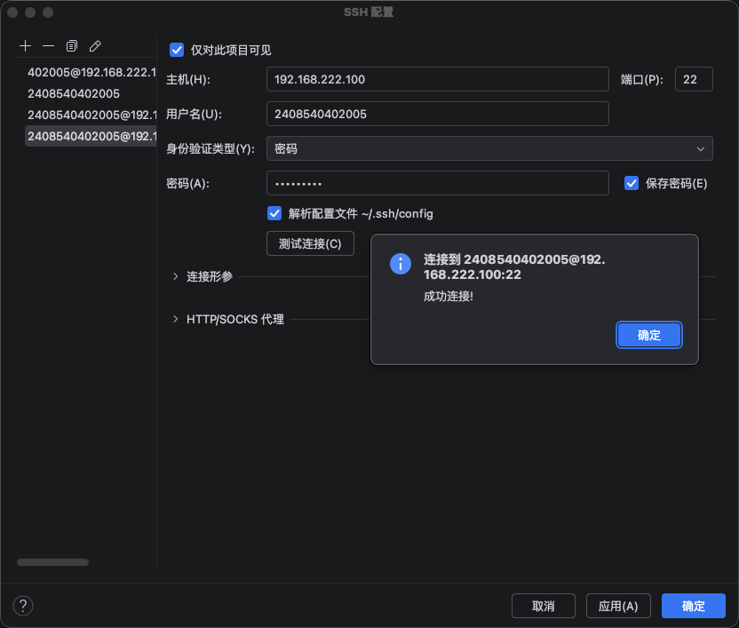

在服务器设置界面也点一下测试连接，成功连接则服务器设置完毕

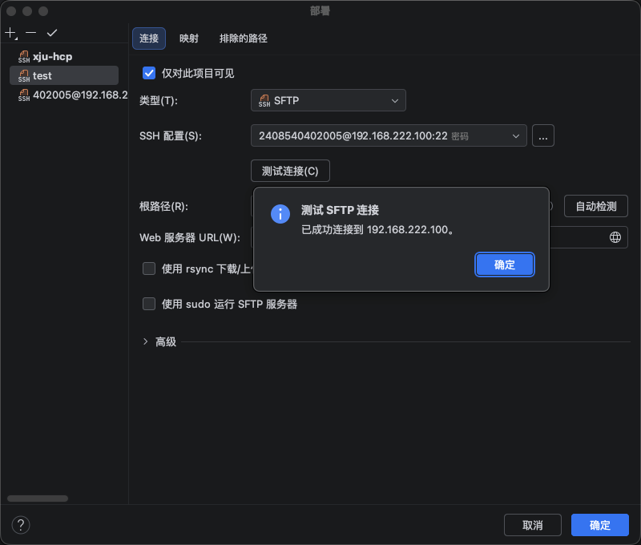

现在，我们需要设置远端和本地的项目同步路径，点击上方的映射按钮，选择刚刚那个服务器设置，点击部署路径

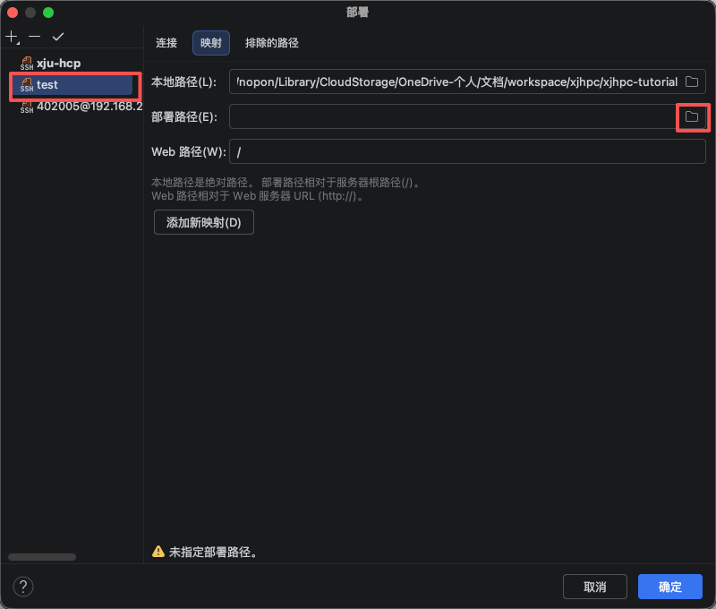

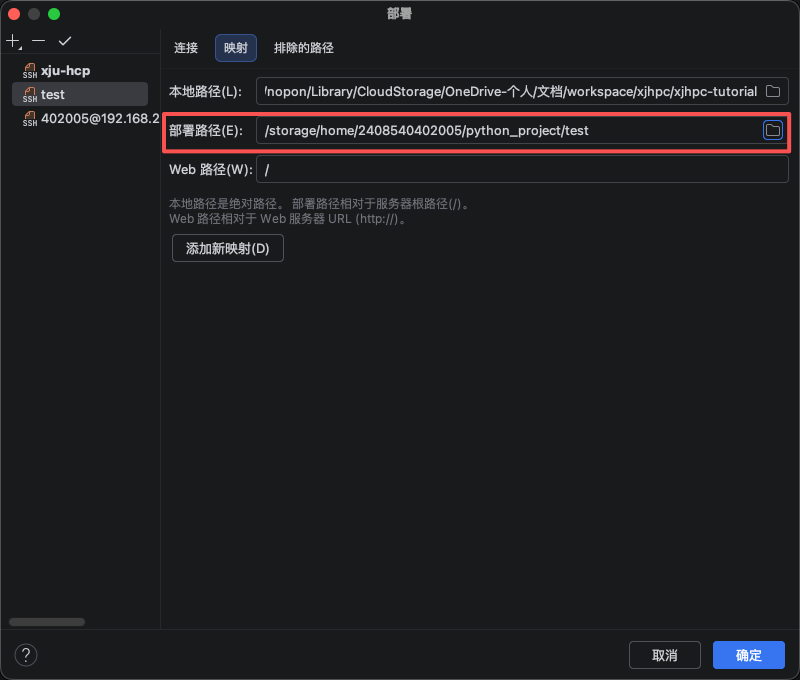

设置好后，点击确定，返回主界面，右击项目目录，选择部署-上传

此时会将本地的项目同步到刚刚设置的那个远端路径里

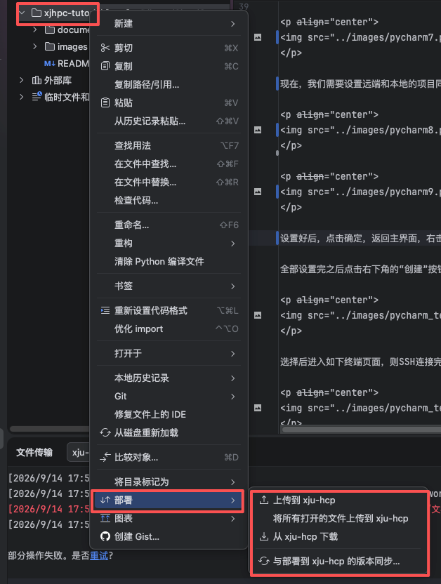

全部设置完之后点击右下角的“创建”按钮，等待其配置完成后，点击pycharm页面左下角的“终端”按钮，点击下拉箭头，选择刚刚设置好的远程终端，

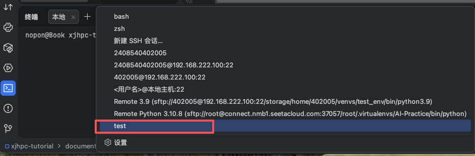

选择后进入如下终端页面，则SSH连接完成。

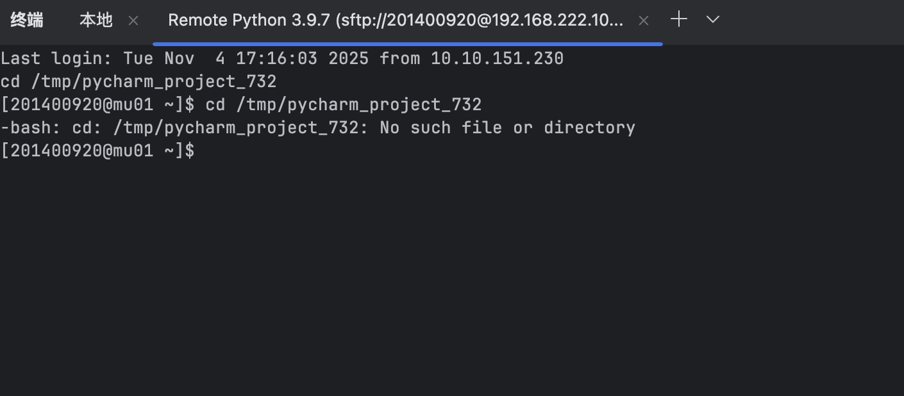

点击工具-部署-浏览远程主机 可以打开一个远程主机目录侧边栏，方便确认远端的文件

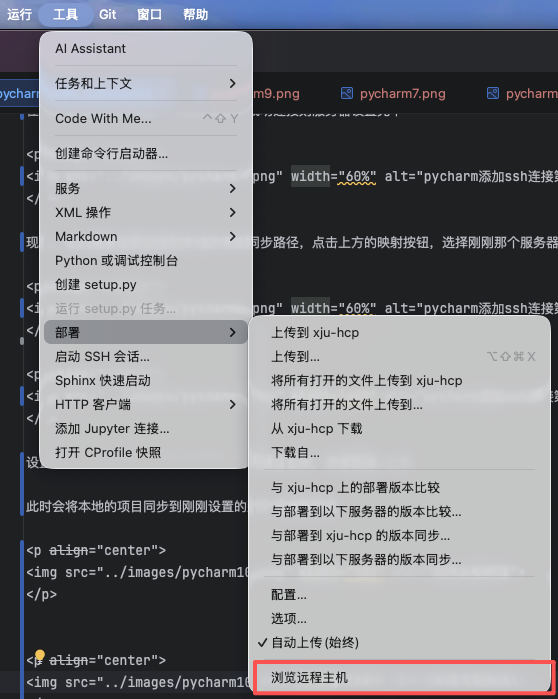

