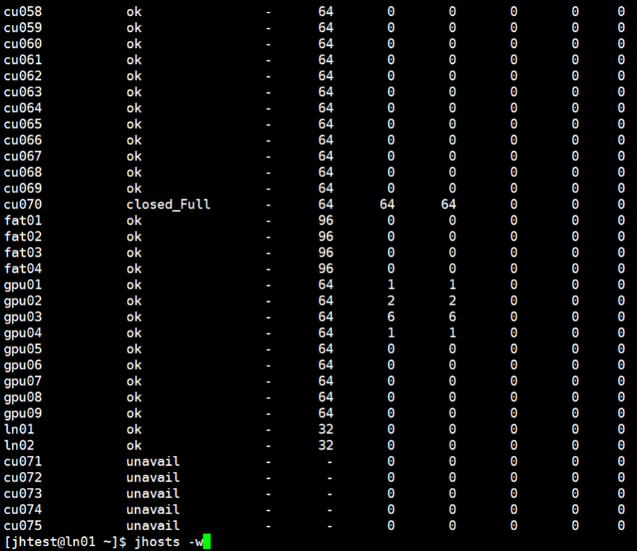
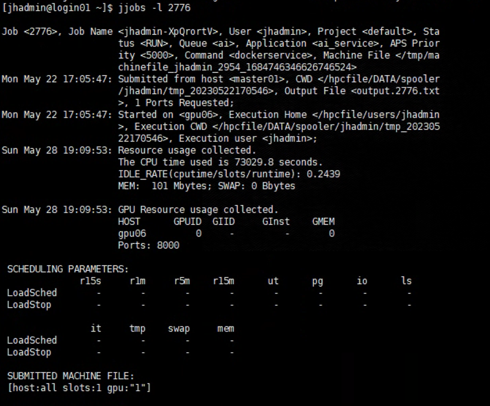
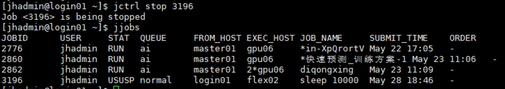
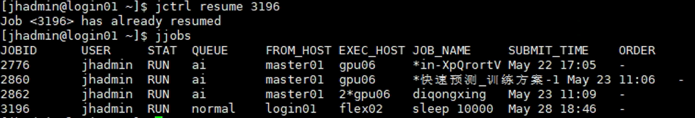
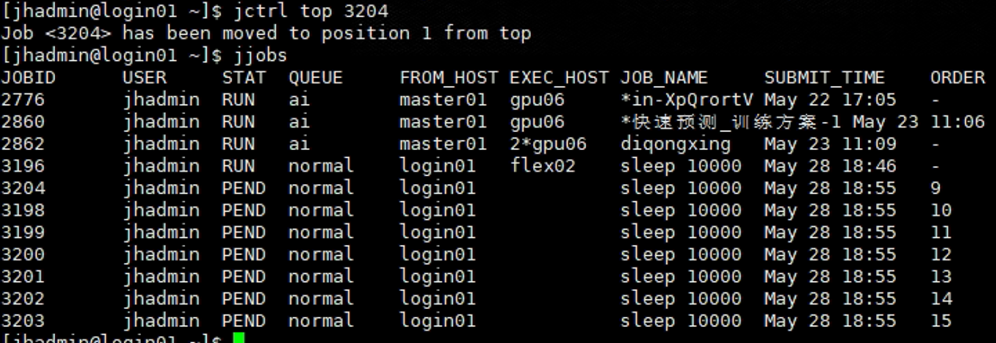
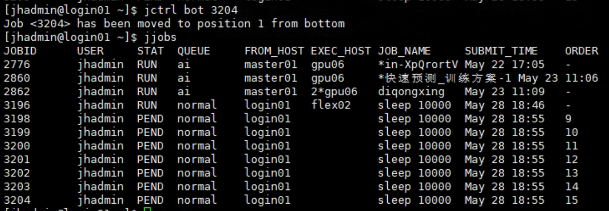

# 高算平台 JH UniScheduler 作业调度系统命令手册

本文介绍西交超算平台普通用户最常用的 JH UniScheduler 命令，并为每类命令提供可复制的示例。命令已于 2026-07-19 在登录节点 `mu01`、JH UniScheduler 6.3 上做过只读核验。

> 登录节点只用于编辑、下载、环境配置和提交作业。训练、编译、大规模数据处理以及 GPU 检测必须通过 `jsub` 提交到计算节点。
>
> 队列、节点、GPU 型号和账号权限会变化。每次提交前都应重新运行 `jqueues -u "$USER"` 和 `jhosts`。

## 1. 命令总览

| 命令 | 用途 | 最常用示例 |
| --- | --- | --- |
| `jqueues` | 查看队列及本人可用队列 | `jqueues -u "$USER"` |
| `jhosts` | 查看计算节点和资源状态 | `jhosts` |
| `jsub` | 提交 CPU 或 GPU 作业 | `jsub -q normal ... COMMAND` |
| `jjobs` | 查看作业状态和详情 | `jjobs -l JOBID` |
| `jctrl peek` | 查看未完成作业输出 | `jctrl peek JOBID` |
| `jctrl stop` | 暂停作业 | `jctrl stop JOBID` |
| `jctrl resume` | 恢复暂停作业 | `jctrl resume JOBID` |
| `jctrl kill` | 终止作业 | `jctrl kill JOBID` |
| `jctrl top` | 将本人等待作业移到队列前部 | `jctrl top JOBID` |
| `jctrl bot` | 将本人等待作业移到队列后部 | `jctrl bot JOBID` |
| `jctrl requeue` | 终止并重新排队 | `jctrl requeue JOBID` |

`JOBID` 是提交成功后调度器返回的作业号。示例中的 `JOBID`、节点名、队列名和路径都必须替换为真实值。

## 2. 查看命令帮助

### `jsub --help`

查看当前版本的提交参数：

```bash
jsub -V
jsub --help || true
```

该版本即使成功打印帮助，也可能返回退出码 1，因此在 Shell 脚本中查看帮助时可加 `|| true`。

### `jctrl --help`

查看作业控制子命令：

```bash
jctrl --help || true
jctrl peek --help || true
jctrl kill --help || true
```

平台升级后，应优先以当前帮助和管理员通知为准。

## 3. `jqueues`：查看队列

### 查看全部可见队列

```bash
jqueues
```

这个命令用于查看队列名称、状态和资源概况。

### 查看本人匹配的队列

```bash
jqueues -u "$USER"
```

实测账号可见的队列包括 `normal`、`docker_image`、`ai_excl`、`ai_share`、`ai_gmem`、`cpu` 和 `gpu`，但其他账号可能不同。

需要同时检查：

- 队列是否出现在本人查询结果中。
- `STATUS` 是否为 `Open:Active`。
- 队列是否提供程序需要的 CPU、内存或 GPU。

`jqueues -u "$USER"` 也可能列出 `Closed:Active` 的匹配队列。出现在结果中不等于当前一定可以提交。

## 4. `jhosts`：查看节点资源

### 查看全部节点

```bash
jhosts
```

用于查看节点名称、状态、CPU、内存和 GPU 等资源。提交 GPU 作业前，应先确认所需 GPU 类型当前存在。



### 查看指定节点详情

```bash
NODE_NAME=gpu02
jhosts -l "$NODE_NAME"
```

`-l` 会显示指定节点的详细资源与属性。节点名必须来自当前 `jhosts` 输出，不要长期照抄示例中的 `gpu02`。

平台实测可见 RTX 3090、A800 80GB、A40 和 RTX 4090 等 GPU，但节点状态和资源会动态变化。

## 5. `jsub`：提交作业

基本格式：

```text
jsub [资源参数] COMMAND [ARGUMENTS...]
```

`jsub` 后半部分就是计算节点最终执行的命令。推荐直接调用项目环境中的 Python 绝对路径，避免依赖交互式 Shell 的激活状态。

### 常用参数

| 参数 | 含义 | 示例 |
| --- | --- | --- |
| `-q QUEUE` | 指定队列 | `-q gpu` |
| `-J NAME` | 指定作业名 | `-J train-resnet` |
| `-cwd DIR` | 指定计算节点工作目录 | `-cwd "$HOME/python_project/test"` |
| `-o FILE` | 标准输出文件 | `-o "$HOME/logs/train.%J.out"` |
| `-e FILE` | 标准错误文件 | `-e "$HOME/logs/train.%J.err"` |
| `-n CORES` | 申请 CPU 核数 | `-n 8` |
| `-M MB` | 申请内存，单位为 MB | `-M 32768` |
| `-W LIMIT` | 设置运行时限 | 格式与上限以当前帮助和队列策略为准 |
| `-gpgpu SPEC` | 申请 GPU 数量及可选规格 | `-gpgpu 1` |

`%J` 会被替换为真实作业号。日志目录必须在提交前创建，否则作业可能因无法打开输出文件而失败。

### 示例 1：提交 CPU Python 作业

```bash
TUTORIAL_DIR="$HOME/python_project/xjhpc-tutorial"
PYTHON="$HOME/venvs/my_project/bin/python"

mkdir -p "$HOME/logs"
test -x "$PYTHON"

jsub -q normal -J hello-python \
  -cwd "$TUTORIAL_DIR" \
  -o "$HOME/logs/hello-python.%J.out" \
  -e "$HOME/logs/hello-python.%J.err" \
  -n 1 -M 2048 \
  "$PYTHON" helloworld.py
```

这个作业申请 1 个 CPU 核和 2048 MB 内存，在教程目录中运行 `helloworld.py`。

### 示例 2：提交通用单 GPU 作业

```bash
TUTORIAL_DIR="$HOME/python_project/xjhpc-tutorial"
PYTHON="$HOME/venvs/my_project/bin/python"

mkdir -p "$HOME/logs"
test -x "$PYTHON"

jsub -q gpu -J pytorch-check \
  -cwd "$TUTORIAL_DIR" \
  -o "$HOME/logs/pytorch-check.%J.out" \
  -e "$HOME/logs/pytorch-check.%J.err" \
  -n 2 -M 8192 \
  -gpgpu 1 \
  "$PYTHON" test_pytorch.py
```

这个作业申请 1 张 GPU、2 个 CPU 核和 8192 MB 内存。环境中必须已经安装 PyTorch。

### 示例 3：指定 A800 80GB GPU 类型

```bash
TUTORIAL_DIR="$HOME/python_project/xjhpc-tutorial"
PYTHON="$HOME/venvs/my_project/bin/python"

mkdir -p "$HOME/logs"

jsub -q gpu -J a800-check \
  -cwd "$TUTORIAL_DIR" \
  -o "$HOME/logs/a800-check.%J.out" \
  -e "$HOME/logs/a800-check.%J.err" \
  -n 2 -M 32768 \
  -gpgpu "1 type=NVIDIAA80080GBPCIe" \
  "$PYTHON" test_pytorch.py
```

`NVIDIAA80080GBPCIe` 是实测帮助中可见的类型字符串。使用前仍应重新查询，因为管理员可能调整资源名称。

### 示例 4：提交项目作业脚本

项目中的 `jobs/train.sh`：

```bash
#!/usr/bin/env bash
set -euo pipefail

PROJECT_DIR="$HOME/python_project/my_project"
PYTHON="$HOME/venvs/my_project/bin/python"

cd "$PROJECT_DIR"
exec "$PYTHON" train.py --config configs/train.yaml
```

提交脚本：

```bash
PROJECT_DIR="$HOME/python_project/my_project"

mkdir -p "$HOME/logs"
jsub -q gpu -J my-train \
  -cwd "$PROJECT_DIR" \
  -o "$HOME/logs/my-train.%J.out" \
  -e "$HOME/logs/my-train.%J.err" \
  -n 8 -M 32768 -gpgpu 1 \
  bash jobs/train.sh
```

复杂实验使用作业脚本更容易记录环境变量、数据路径、随机种子和训练参数。

### 提交成功后的输出

提交成功后，终端会返回作业号。应立即记录该编号，后续的 `jjobs` 和 `jctrl` 都会使用它。


## 6. `jjobs`：查看作业

### 查看本人的作业

```bash
jjobs
```

这是最常用的查询命令，用于查看作业号、名称、状态、队列和运行节点。

### 只看排队作业

```bash
jjobs -p
```

`-p` 用于筛选仍在等待资源的作业。

### 只看运行作业

```bash
jjobs -r
```

`-r` 用于筛选正在运行的作业。

### 查看指定作业详情

```bash
JOBID=18433
jjobs -l "$JOBID"
```

`-l` 会显示更详细的提交参数、资源申请、工作目录、运行节点和状态原因。排队时间过长或作业失败时，应优先检查这里。



### 常见状态

| 状态类别 | 含义 | 建议 |
| --- | --- | --- |
| 等待/排队 | 尚未获得资源 | 检查队列权限、GPU 类型和资源是否申请过量 |
| 运行 | 已在计算节点执行 | 查看日志，确认程序正常推进 |
| 暂停 | 被用户或系统挂起 | 查看原因，必要时使用 `jctrl resume` |
| 完成 | 正常结束 | 检查输出文件和实验结果 |
| 退出/失败 | 异常结束或被终止 | 查看 `.err` 和 `jjobs -l JOBID` |

具体状态字符串以当前调度器输出为准。

## 7. `jctrl peek`：查看未完成作业输出

### 查看当前输出

```bash
JOBID=18433
jctrl peek "$JOBID"
```

适合快速查看未完成作业的标准输出和错误输出。

### 持续跟踪输出

```bash
JOBID=18433
jctrl peek -f "$JOBID"
```

`-f` 会持续跟踪输出，效果类似 `tail -f`。按 `Ctrl+C` 只会停止本地查看，不会终止作业。

### 查看数组作业中的指定任务

```bash
JOBID=18433
TASK_ID=3
jctrl peek -t "$TASK_ID" "$JOBID"
```

只有数组作业才需要 `-t TASK_ID`。普通作业直接使用 `jctrl peek JOBID`。

## 8. `jctrl stop`：暂停作业

```bash
JOBID=18433
jctrl stop "$JOBID"
```

用于暂停未完成作业。暂停不会删除作业，但运行中的程序可能停止获得计算资源，具体行为取决于平台策略。



暂停后检查：

```bash
JOBID=18433
jjobs -l "$JOBID"
```

## 9. `jctrl resume`：恢复作业

```bash
JOBID=18433
jctrl resume "$JOBID"
```

用于恢复已经暂停的作业。恢复后作业可能继续运行，也可能重新等待资源。



## 10. `jctrl kill`：终止作业

> 这是破坏性操作。终止前应再次核对作业号，并确认检查点和输出已经保存。

```bash
JOBID=18433
jjobs -l "$JOBID"
jctrl kill "$JOBID"
```

终止后作业通常进入退出状态，不能通过 `resume` 继续。平台不存在 `jcancel` 或 `jskill` 命令，普通终止操作使用 `jctrl kill`。

## 11. `jctrl top`：前移等待作业

```bash
JOBID=18433
jctrl top "$JOBID"
```

用于将本人的等待作业移动到队列前部。它主要调整账号内部的等待顺序，不代表能够越过调度策略、管理员优先级或其他用户作业。



## 12. `jctrl bot`：后移等待作业

```bash
JOBID=18433
jctrl bot "$JOBID"
```

用于将本人的等待作业移动到队列后部，适合暂时降低某个等待作业的顺序，让同账号其他作业优先。



## 13. `jctrl requeue`：重新排队

> `requeue` 可能终止当前执行实例并重新排队。使用前应确认程序支持从检查点恢复，否则可能丢失本轮尚未保存的计算进度。

```bash
JOBID=18433
jjobs -l "$JOBID"
jctrl requeue "$JOBID"
```

重新排队后再次运行：

```bash
jjobs
```

检查作业是否重新进入等待状态，以及作业号和提交参数是否发生变化。

## 14. 查看已经写入文件的日志

`jctrl peek` 主要用于未完成作业。若已经通过 `-o` 和 `-e` 指定日志，任何时候都可以直接读取文件。

```bash
JOBID=18433

less "$HOME/logs/my-train.$JOBID.out"
less "$HOME/logs/my-train.$JOBID.err"
```

持续查看日志：

```bash
JOBID=18433
tail -f "$HOME/logs/my-train.$JOBID.out"
```

按 `Ctrl+C` 退出 `tail -f` 不会影响远端作业。

## 15. 一次完整的作业流程

```bash
# 1. 查询本人可用队列和当前节点
jqueues -u "$USER"
jhosts

# 2. 创建日志目录
mkdir -p "$HOME/logs"

# 3. 提交作业
jsub -q normal -J hello-python \
  -cwd "$HOME/python_project/xjhpc-tutorial" \
  -o "$HOME/logs/hello-python.%J.out" \
  -e "$HOME/logs/hello-python.%J.err" \
  -n 1 -M 2048 \
  "$HOME/venvs/my_project/bin/python" helloworld.py

# 4. 复制提交命令返回的真实作业号
JOBID=18433

# 5. 查看状态、详情和输出
jjobs
jjobs -l "$JOBID"
jctrl peek "$JOBID"
```

不要直接复制示例中的 `18433`；它只是展示变量用法。

## 16. 常见问题排查

### 作业一直排队

依次检查：

```bash
jqueues -u "$USER"
jhosts
jjobs -p

JOBID=18433
jjobs -l "$JOBID"
```

常见原因包括队列关闭、没有权限、指定 GPU 类型暂时无空闲资源、CPU/内存/GPU 申请过量，或账号达到并发上限。

### 作业提交后立即失败

```bash
JOBID=18433
jjobs -l "$JOBID"
jctrl peek "$JOBID"
```

重点检查：

- `-cwd` 指向的目录是否存在。
- Python 或可执行文件是否存在并具有执行权限。
- 日志目录是否提前创建。
- 输入文件、数据目录和配置文件是否可读。
- 作业脚本是否使用了只在交互式 Shell 中存在的环境。

### GPU 程序看不到 GPU

确认作业确实通过 GPU 队列提交并申请了 `-gpgpu`：

```bash
JOBID=18433
jjobs -l "$JOBID"
jctrl peek "$JOBID"
```

登录节点的 `nvidia-smi` 无法连接 GPU 驱动，登录节点测试不能证明计算节点 GPU 是否可用。

### 输出文件没有生成

提交前先创建目录：

```bash
mkdir -p "$HOME/logs"
test -w "$HOME/logs"
```

同时确认 `-o`、`-e` 路径正确，并使用 `%J` 区分不同作业。

## 17. 提交前检查表

- 已用 `jqueues -u "$USER"` 确认本人可用队列和 `Open:Active` 状态。
- 已用 `jhosts` 确认所需节点资源和 GPU 类型当前存在。
- 已创建日志目录。
- `-cwd`、Python、脚本、配置和数据路径都正确。
- CPU、内存、运行时限和 GPU 申请与程序规模相符。
- 标准输出和错误输出写入不同文件，并包含 `%J`。
- 训练、编译和 GPU 测试没有直接在登录节点运行。
- 已记录作业号，并准备通过 `jjobs -l` 和日志检查运行状态。
