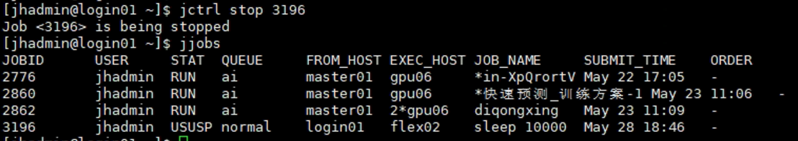
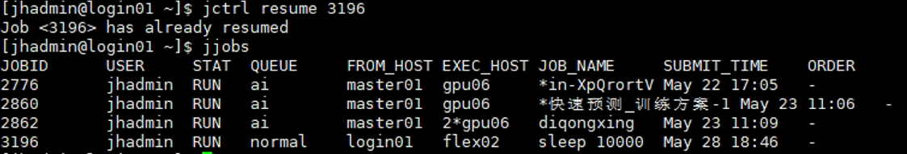
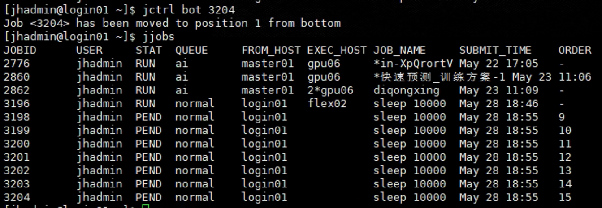
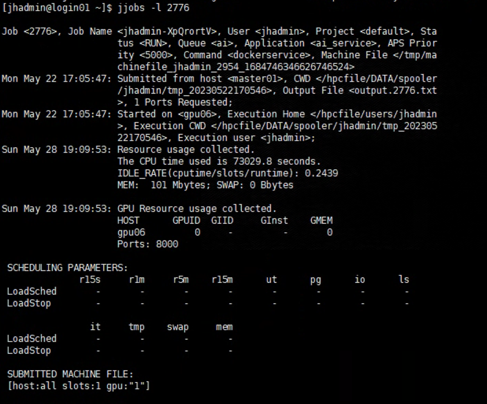

# 高算平台作业调度系统命令手册

## 命令及示例

### jhosts --节点资源查看

   ```
   jhosts #查看全部节点资源
   jhosts -l $hostname #查看指定节点资源
   示例
   jhosts -l cu01
   ```

### jqueues --队列资源查看
   ```
   jqueues
   jqueues -u <自己账户名> #来列出自己可用的队列
   ```

### jsub --作业提交命令（极为重要！！！）
   ```
   jsub -n <CPU核数> -m <指定节点或节点组》-W <时:分> -gpgpu <qpu数量和gpu类型> -q<队列名> -j <作业名> -o <程序输出路径及文件名> -e <程序报错输出路径及文件名》-cmd <作业执行路径> ./coamandline
   ```
- `-n <CPU数>` 申请作业所需的 CPU 核数，不能超过队列资源限制。
- `-m <指定节点或节点组>` 提交作业时指定在某个节点或节点组上执行。
- `-W <指定作业运行时间>` 提交作业时指定作业的最长运行时间，格式为 `xx:xx`（时:分）。
- `-gpgpu <gpu数量和gpu类型>` 申请运行作业的 GPU 数量和类型。
- `-q <队列名>` 指定作业运行的队列。所有作业会提交到该队列；资源不足时排队，满足时派发执行。队列由管理员分配，提交前请确认是否有权限（例如：`jqueues -u <自己账户名>` 查看可用队列）。
- `-J <作业名>` 指定作业名，便于辨识。
- `-o <输出文件名>` 指定调度系统的标准输出文件。`%J` 表示作业号，例如：`-o output.%J` 会在提交目录生成带作业号的文件。
- `-e <错误输出文件名>` 指定可执行文件运行时的错误输出文件。
- `-cwd <作业执行路径>` 指定作业在派发节点上的工作目录；未指定时默认为提交路径。需确保该目录每一层对当前用户均有读、写、执行权限。


   ```
   作业提交示例：
   jsub -m gpu01 -q gpu -gpgpu 1 -W 00:01 -o "$HOME/logs/output.%J" -e "$HOME/logs/error.%J" -cwd "$HOME/python_project/test" "$HOME/venvs/test_env/bin/python" helloworld.py
   ```
其含义为 指定gpu01节点，指定gpu队列，指定调用gpu数量1个，作业最大运行时间1分钟，程序输出与报错文件在用户根目录的logs文件夹内，文件名分别为output.%J与error.%J(%J为该作业的作业编号)，该作业在"$HOME/python_project/test"中执行，调用的是test_env环境中的python，执行helloworld.py文件。

提交后模型会输出


### jctrl --作业控制命令
   ```
   jctrl stop $JOBID #挂起运行或是排队中的作业 JOBID为作业id
   示例：
   jctrl stop 3196
   ```

   ```
   jctrl resume $JOBID #恢复挂起的作业 JOBID为作业id
   示例：
   jctrl resume 3196
   ```

   ```
   jctrl top $JOBID #作业置顶 JOBID为作业id
   示例：
   jctrl top 3204
   ```

   ```
   jctrl top -p $id $调整作业排队的顺序（账号内调整），id为调整的顺序
   示例：
   jctrl top -p 3 3204
   ```

   ```
   jctrl bot $排队作业置底
   示例：
   jctrl bot 3204
   ```


### jjobs --查看作业
   ```
   jjobs
   jjobs -a #查询所有作业
   jjobs -l %JOBID #查看指定作业纤细信息
   示例：
   jjobs -l 2776
   ```



